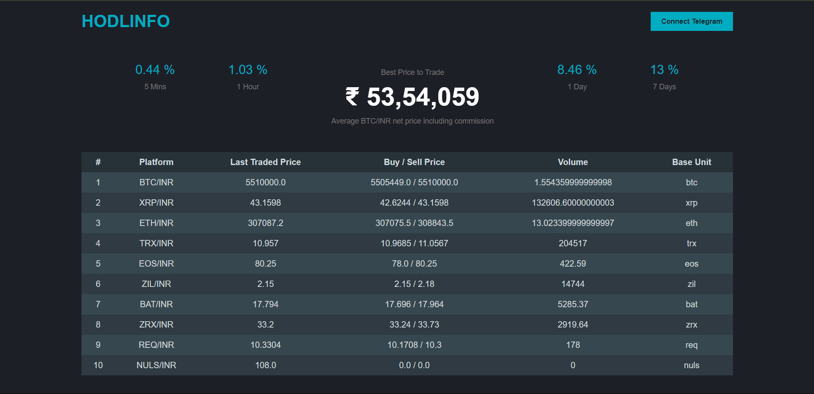

# Hodlinfo Web Application

A comprehensive web application designed to display real-time cryptocurrency trading information, integrating a backend server for data fetching and storage, and a frontend for displaying the data.

## Features

- Real-time display of cryptocurrency statistics such as percentage changes over various time frames (5 mins, 1 hour, 1 day, 7 days).
- Shows the best price to trade, including the average BTC/INR net price including commission.
- Dynamically populated table with trading information from various platforms, including last traded price, buy/sell price, volume, and base unit.
- Backend server that fetches data from an external API, stores it in a PostgreSQL database, and serves it to the frontend.
- Periodic data fetching on the frontend to keep the information up to date.

## Technologies Used

- **Frontend**: HTML5, CSS, JavaScript
- **Backend**: Node.js, Express.js
- **Database**: PostgreSQL with Sequelize ORM
- **External API**:  API for fetching ticker information

## Setup and Installation

1. **Database Setup**: Ensure PostgreSQL is installed and running on your system. Create a database named `hodlinfo`.

2. **Backend Setup**:

   - Navigate to the backend directory.
   - Run `npm install` to install dependencies.
   - Update the Sequelize configuration in the server file with your PostgreSQL credentials.
   - Start the server with `node server.js`.

3. **Frontend Setup**:
   - The frontend static files are served by the Express server. Ensure the server is running, and navigate to `http://localhost:3000` in your web browser.

## API Endpoints

- **GET `/fetch-tickers`**: Fetches ticker data from the WazirX API and stores it in the database.
- **GET `/tickers`**: Retrieves ticker data from the database and sends it to the frontend.

## How It Works

1. The server fetches cryptocurrency data from the WazirX API and stores it in a PostgreSQL database.
2. The frontend periodically fetches this data from the server and updates the display with the latest trading information.
3. Users can see real-time updates on cryptocurrency statistics and trading information.

## Note

This README assumes that you have basic knowledge of Node.js, Express, and PostgreSQL. Ensure that all dependencies are correctly installed and that the database is properly set up before starting the server.
